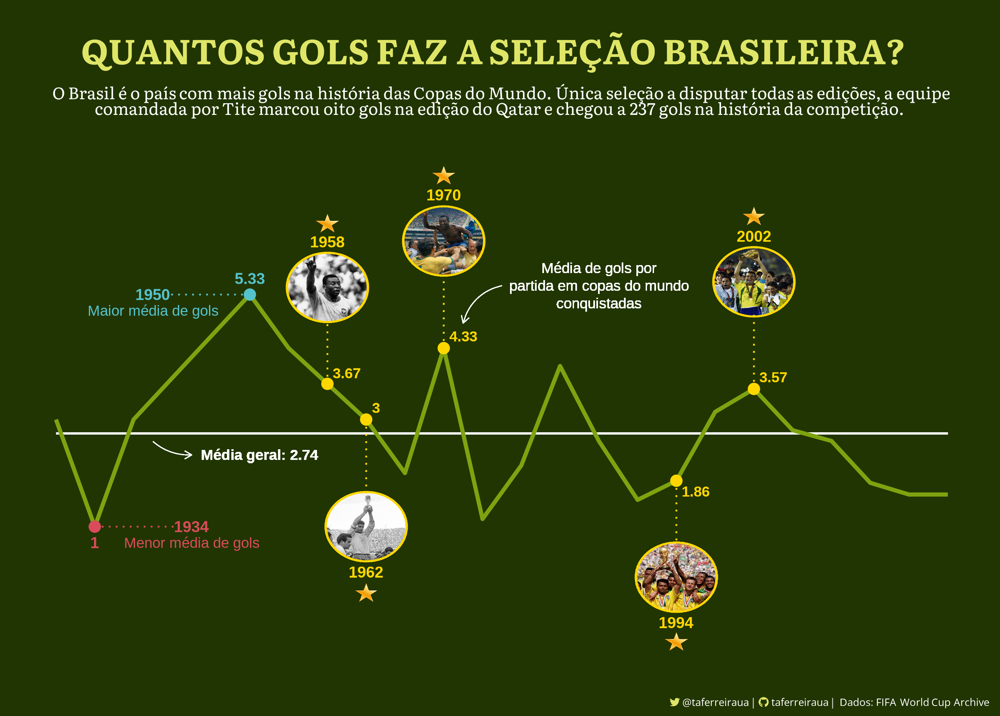
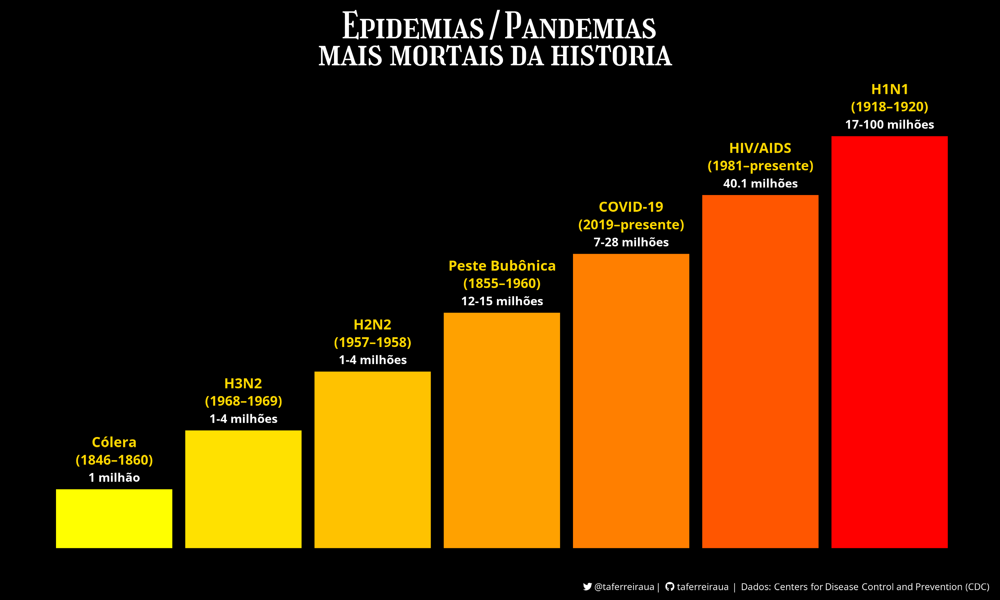

# Estudos-de-Exploracao-e-Visualizacao-de-Dados

## Sobre
> Estudando meios de exploração e visualização de dados em R e Python.

## Visualizações

  ### - **[Star Wars Attribute Matrix](Star-Wars-Attribute-Matrix**
  
  
  ### - **[Quantos gols faz a seleção brasileira?](Brasil-WorldCup)**
  
  
  ### - **[Pandemias/Epidemias mais mortais da história](Major-Disease-Outbreaks)**
  Maiores surtos de doenças hankeados pelo número estimado de mortos.
  

  ### - **[Morte no piloto automático](Tesla-Deaths)**
  
  
  ### - **[Uma timeline dos acidentes aéreos no Nepal](Nepal-Plane-Crashes)**
  
  
  ### - **[Which director is the highest rated?](Mandalorian-Directors)**
  
  
  ### - **[Covid-19 vaccination across the world](World-Vaccination-Covid19)**
  
