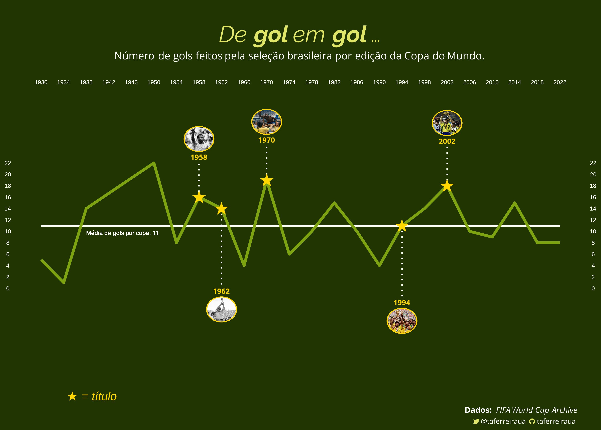

# Estudos de Exploração e Visualização de Dados

## Sobre
 Estudando meios de exploração e visualização de dados em R e Python.

  ### **[_Van Gogh's Styles & Subjects_](Van-Gogh-Styles)**
  Visualizando a distribuição dos temas de 1931 obras de _Vincent Van Gogh_ por movimento artístico.
  - 📦 Packages: `ggplot`, `ggtext`.
  - 💾 Dados: WikiArt, por _Konstantinos Katserelis_.
  
  
  
  
  ### **[_Covid-19 vaccination across the world_](World-Vaccination-Covid19)**
  Progresso de vacinação contra Covid-19 por país no mundo até janeiro de 2023.
  - 📦 Packages `ggplot`, `ggtext`.
  - 💾 Dados: Our World In Data.
  
  
  
  
  ### **[_De gol em gol..._](Brasil-WorldCup)**
  Número de gols do Brasil por Copa do Mundo.
  - 📦 Packages: `ggplot`, `ggtext`, `ggimage`.
  - 💾 Dados: FIFA World Cup Archive.
  
  
  
  
  ### **[_Demanda de energia elétrica no Brasil em 2022_](Brasil-ONS)**
  Visualizando o uso de energia elétrica no Brasil em 2022.
  - 📦 Packages: `ggplot`, `ggtext`, `ggdraw`.
  - 💾 Dados: Operador Nacional do Sistema Elétrico (ONS).
  
  
 
