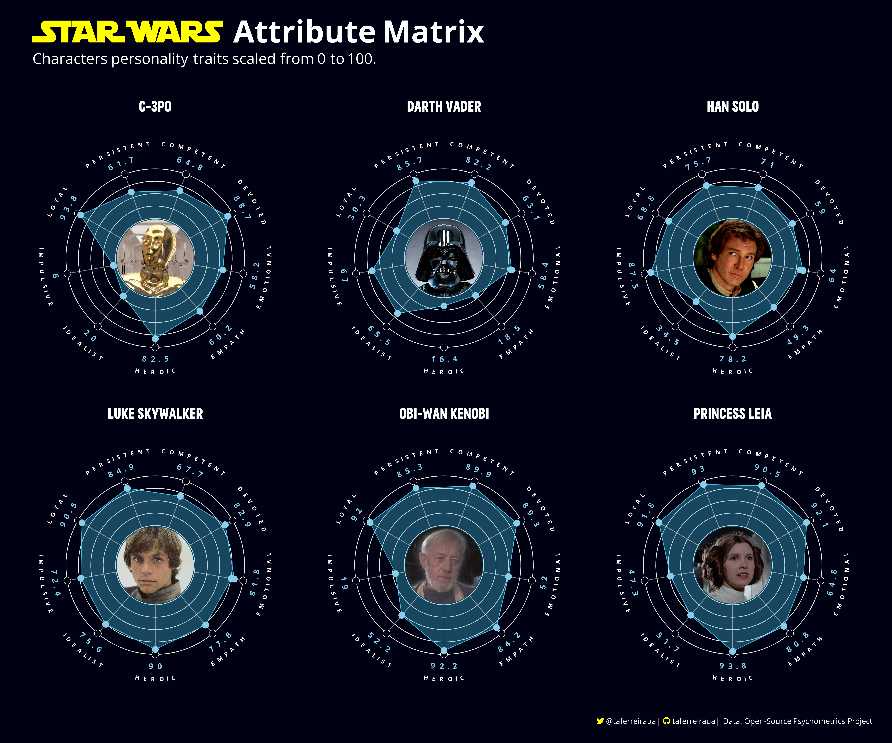
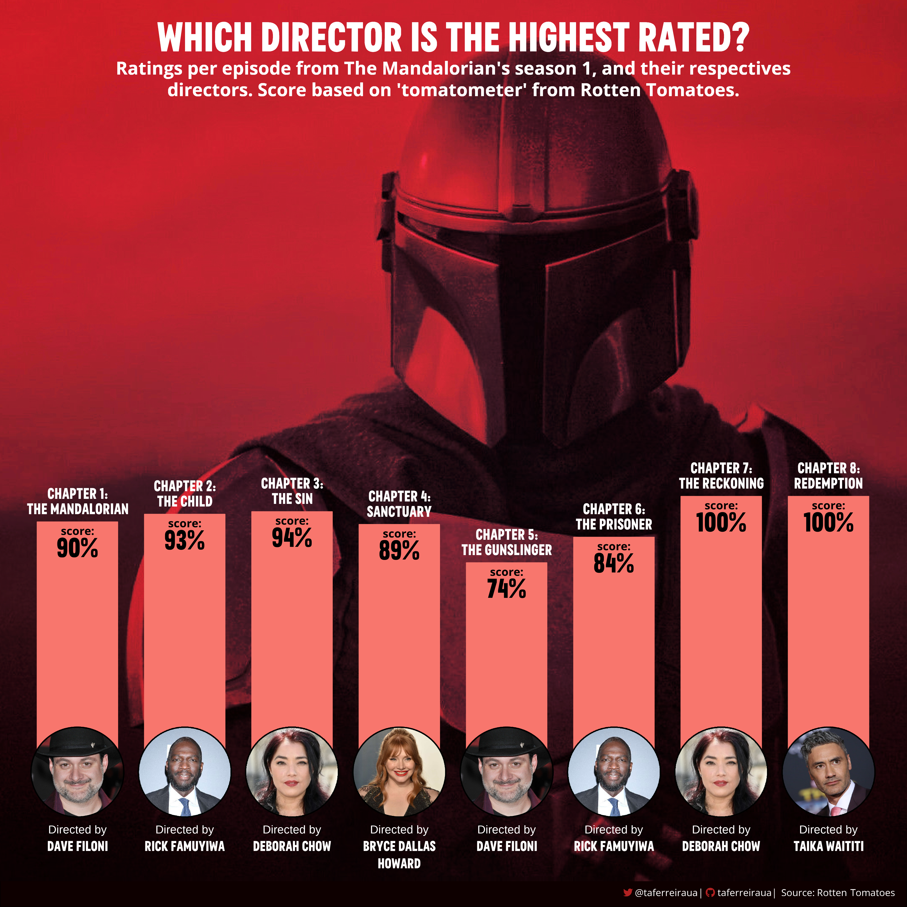
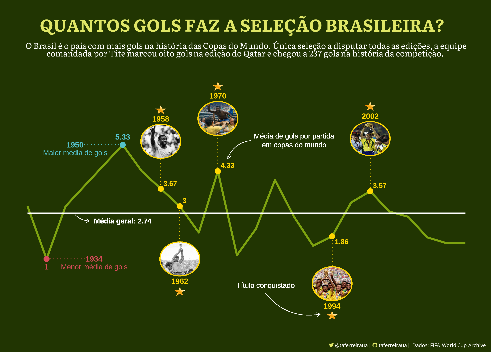
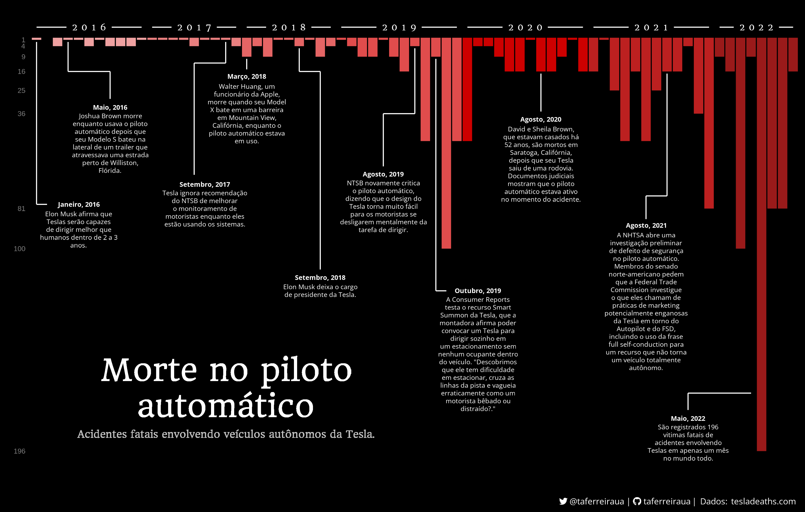
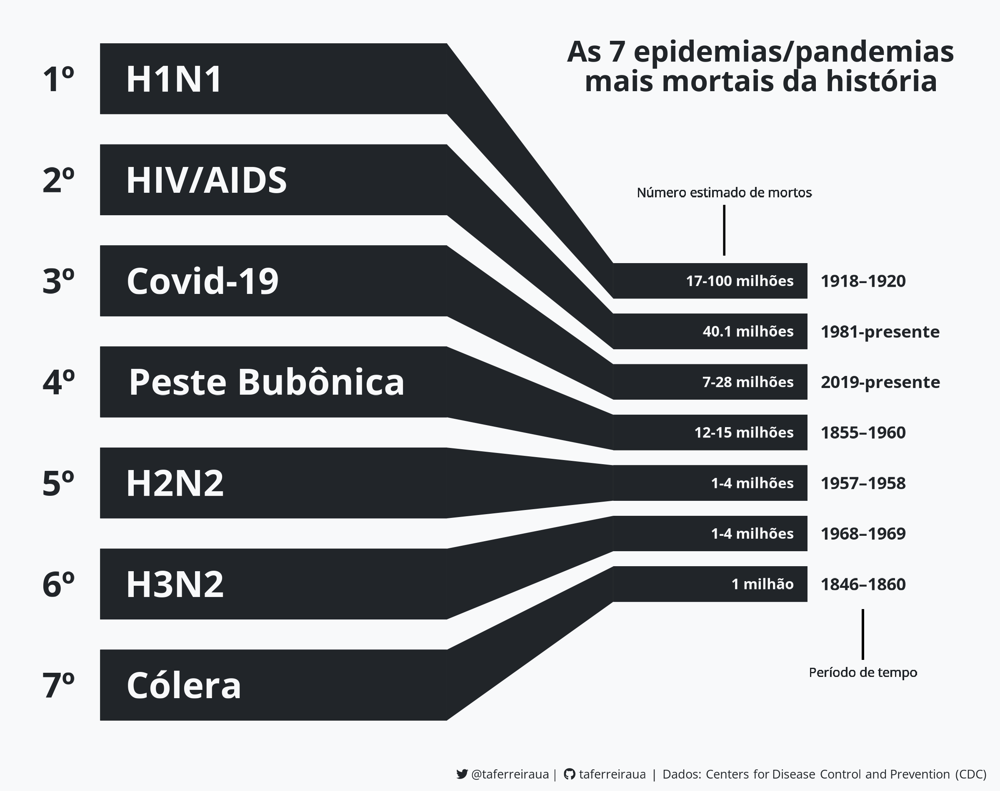

# Estudos de Exploração e Visualização de Dados

## Sobre
 Estudando meios de exploração e visualização de dados em R e Python.

## Resumo

| **Tópico**                                                              | **Packages**                          | **Dados**                                  |
|:------------------------------------------------------------------------|:--------------------------------------|:-------------------------------------------|
| [Star Wars Attribute Matrix](Star-Wars-Attribute-Matrix)                | ggplot, ggtext, ggimage               |  Open-Source Psychometrics                  |
| [Quantos gols faz a seleção brasileira?](Brasil-WorldCup)               | ggplot, ggtext, ggimage               | FIFA World Cup Archive                     |
| [Pandemias/Epidemias mais mortais da história](Major-Disease-Outbreaks) | ggplot, ggtext                        | Centers for Disease Control and Prevention |
| [Morte no piloto automático](Tesla-Deaths)                              | ggplot, ggtext, ggimage               | Tesla Deaths Website                       |
| [Uma timeline dos acidentes aéreos no Nepal](Nepal-Plane-Crashes)       | ggplot, ggtext, ggimage               | Plane Crash Info                           |
| [Which director is the highest rated?](Mandalorian-Directors)           | ggplot, ggtext, ggimage, ggpubr       | Rotten Tomatoes                            |
| [Covid-19 vaccination across the world](World-Vaccination-Covid19)      | ggplot, ggtext                        | Our World In Data                          |

## Galeria

  ### **[Star Wars Attribute Matrix](Star-Wars-Attribute-Matrix)**
  
  
  ### **[Covid-19 vaccination across the world](World-Vaccination-Covid19)**
  
  
  ### **[Which director is the highest rated?](Mandalorian-Directors)**
  
  
  ### **[Quantos gols faz a seleção brasileira?](Brasil-WorldCup)**
  
  
  ### **[Uma timeline dos acidentes aéreos no Nepal](Nepal-Plane-Crashes)**
  
  
  ### **[Morte no piloto automático](Tesla-Deaths)**
  
  
  ### **[Pandemias/Epidemias mais mortais da história](Major-Disease-Outbreaks)**
  Maiores surtos de doenças hankeados pelo número estimado de mortos.
  
  
