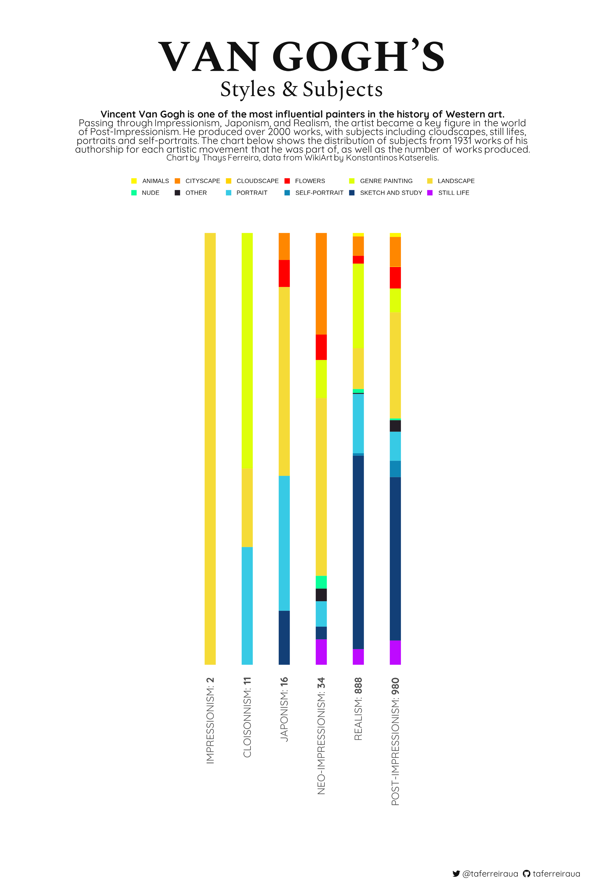
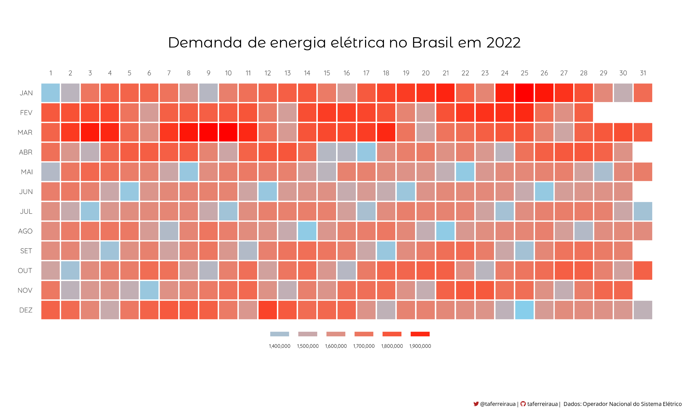

# Estudos de Exploração e Visualização de Dados

## Sobre
 Estudando meios de exploração e visualização de dados em R e Python.

## Resumo

| **Tópico**                                                              | **Packages**                          | **Dados**                                  |
|:------------------------------------------------------------------------|:--------------------------------------|:-------------------------------------------|
| [Van Gogh's Styles & Subjects](Van-Gogh-Styles)                         | ggplot, ggtext                        | WikiArt by Konstantinos Katserelis         |
| [Quantos gols faz a seleção brasileira?](Brasil-WorldCup)               | ggplot, ggtext, ggimage               | FIFA World Cup Archive                     |
| [Morte no piloto automático](Tesla-Deaths)                              | ggplot, ggtext, ggimage               | Tesla Deaths Website                       |
| [Which director is the highest rated?](Mandalorian-Directors)           | ggplot, ggtext, ggimage, ggpubr       | Rotten Tomatoes                            |
| [Covid-19 vaccination across the world](World-Vaccination-Covid19)      | ggplot, ggtext                        | Our World In Data                          |
| [Demanda de energia elétrica no Brasil em 2022](Brasil-ONS)             | ggplot, ggdraw                        | Operador Nacional do Sistema Elétrico (ONS)|

## Galeria

  ### **[Van Gogh's Styles & Subjects](Van-Gogh-Styles)**
  
  
  ### **[Covid-19 vaccination across the world](World-Vaccination-Covid19)**
  
  
  ### **[Which director is the highest rated?](Mandalorian-Directors)**
  
  
  ### **[Quantos gols faz a seleção brasileira?](Brasil-WorldCup)**
  
  
  ### **[Demanda de energia elétrica no Brasil em 2022](Brasil-ONS)**
  
  
  ### **[Morte no piloto automático](Tesla-Deaths)**
  
 
  
