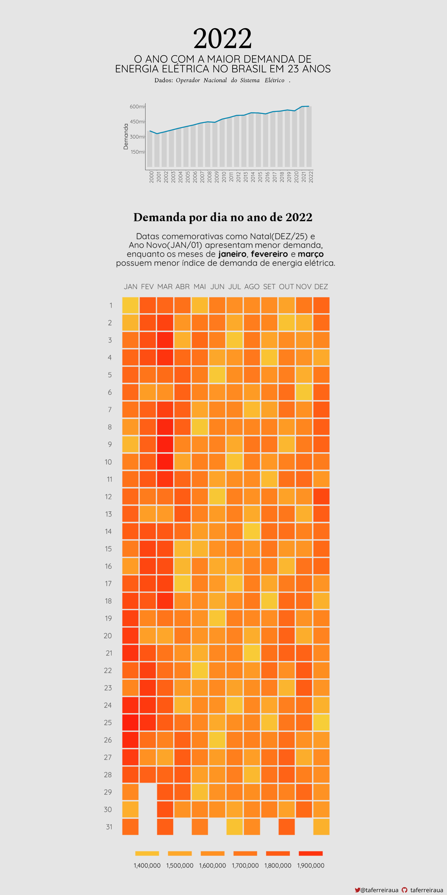

# Estudos de Exploração e Visualização de Dados

## Sobre
 Estudando meios de exploração e visualização de dados em R e Python.

## Galeria

  ### **[Van Gogh's Styles & Subjects](Van-Gogh-Styles)**
  
  
  ### **[Covid-19 vaccination across the world](World-Vaccination-Covid19)**
  
  
  ### **[Which director is the highest rated?](Mandalorian-Directors)**
  
  
  ### **[Quantos gols faz a seleção brasileira?](Brasil-WorldCup)**
  
  
  ### **[Demanda de energia elétrica no Brasil em 2022](Brasil-ONS)**
  
  
  ### **[Morte no piloto automático](Tesla-Deaths)**
  
 
  
